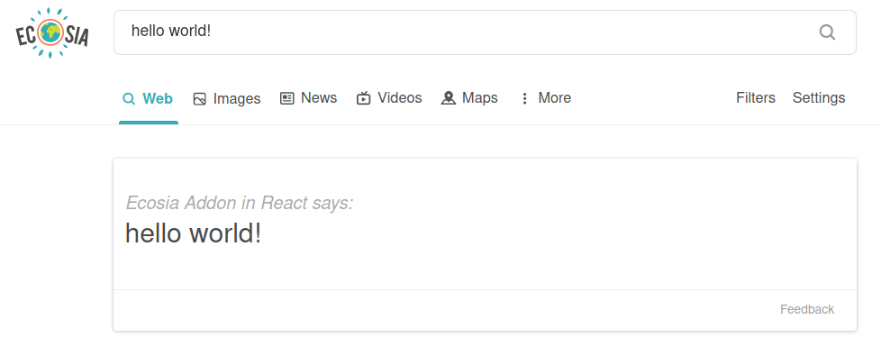

## Ecosia Addon in React (E.A.R.)
**A tool that makes planting trees even easier**

### About
This is boilerplate code for making a search extension for Ecosia, most of which is forked from [kryptokinght's react-extension-boilerplate](https://github.com/kryptokinght/react-extension-boilerplate). It allows developers to easily create cool features like DuckDuckGo's [password generation feature](https://duckduckgo.com/?q=password+strong+12&ia=answer) _[(more info)](https://help.duckduckgo.com/duckduckgo-help-pages/features/instant-answers-and-other-features/)_ or Google(🤢)'s [timer feature](https://www.google.com/search?q=timer) with React.
My example plugin just echos "Hello world" if you search it in Ecosia... but the possibilities are truly endless! The idea is that cool new features will help reel in new users to Ecosia, and new Ecosia users === more trees planted 🌳💞.


### Installation
```
# clone the repo
$ git clone git@github.com:nbennett320/ecosia-plugin-react.git

# not sure what does but it seems to work
$ cd ecosia-plugin-react/

# install dependencies with yarn
$ yarn install
```

### Usage
Using E.A.R. is very simple &ndash; all you need to do is replace the `<ExampleComponent/>` in `src/content_scripts/Main.js` with a component of your own:
```
render() {
  const { query } = this.props
  return (
    <div className="widget-container" style={styles.main}>
      {/* replace me..! */}
      <ExampleComponent query={query} />
      <Footer />
    </div>
  )
}
```
From there, you are only limited by your imagination! 
<br />
<br />
The scope which Content Scripts can access from the browser _(more about this [here](https://developer.mozilla.org/en-US/docs/Mozilla/Add-ons/WebExtensions/Content_scripts))_, so by default background scripts are enabled. For this reason, background scripts are used to implement even cooler features (like async things (like calling an API)) You can read more about this _[here](https://developer.mozilla.org/en-US/docs/Mozilla/Add-ons/WebExtensions/Content_scripts#Communicating_with_background_scripts)_, and _[these](https://developer.mozilla.org/en-US/docs/Mozilla/Add-ons/WebExtensions/API/runtime/onMessage)_ are some example use cases.
<br />
__If you want to remove/disable background scripts, do the following:__
<br />
 - Remove background scripts from the `src/manifest.json`
```
"background": {
  "scripts": [
    "lib/js/browser-polyfill.js",
    "background.js"
  ]
},
```
 - Remove this from `paths.js`
```
appBackgroundJs: resolveModule(resolveApp, 'src/background_scripts/index'),
```
 - Then you can just delete the `src/background_scripts` folder entirely if you want
<br />

### Development && Building
```
# open a development window in firefox 
$ yarn run start:firefox

# open a development window in (🤢) chrome 
$ yarn run start:chrome

# build files to './extension'
$ yarn run build

# compress build folder to {manifest.name}.zip and crx
$ npm run build
$ npm run compress -- [options]
```

More info and details can be found on [kryptokinght's repo](https://github.com/kryptokinght/react-extension-boilerplate).